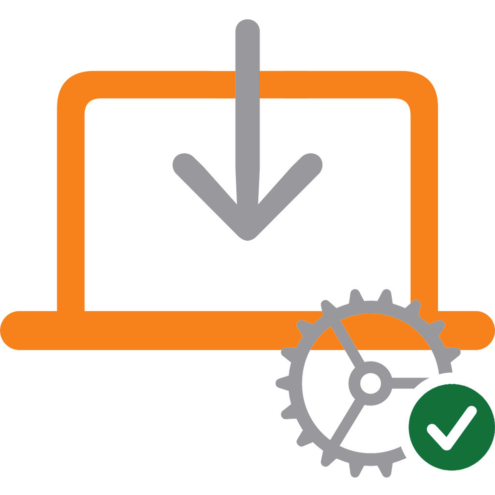
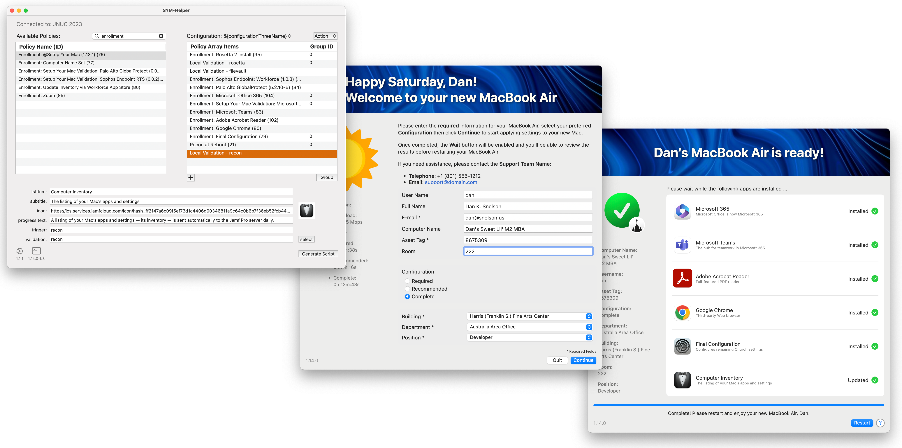
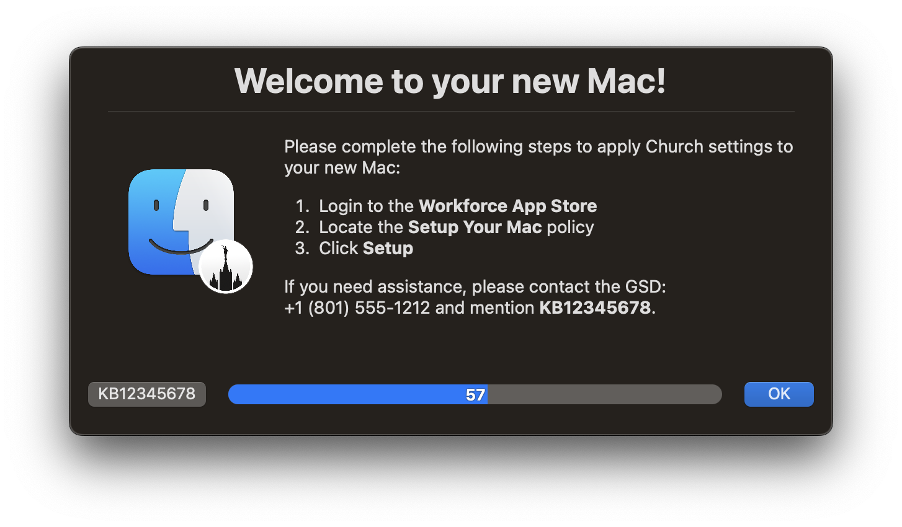

<!-- markdownlint-disable-next-line first-line-heading no-inline-html -->

 
# Setup Your Mac (1.14.0) with SYM-Helper (1.1.1) via swiftDialog (2.4.0)

    

> Optimized to leverage SYM-Helper (1.1.1), Setup Your Mac (1.14.0) leverages new features of swiftDialog (2.4.0)

## Introduction

Apple's Automated Device Enrollment helps streamline Mobile Device Management (MDM) enrollment and device Supervision during activation, enabling IT to manage enterprise devices with "zero touch."

**Setup Your Mac** aims to simplify initial device configuration by leveraging `swiftDialog` and Jamf Pro Policy Custom Events to allow end-users to self-complete Mac setup _post-enrollment_.

[Continue reading …](https://snelson.us/symh)

### Script
- [Setup-Your-Mac-via-Dialog.bash](Setup-Your-Mac-via-Dialog.bash)

### Contributors
A special thanks to the ever-growing list of [contributors](CONTRIBUTORS.md); learn how you can [contribute](CONTRIBUTING.md).

---

# SYM-Helper

> A stand-alone macOS app to help MacAdmins more easily deploy [Setup Your Mac](https://snelson.us/sym)

**NOTE:** When editing [Setup-Your-Mac-via-Dialog.bash](Setup-Your-Mac-via-Dialog.bash), &ldquo;[SYM-Helper]&rdquo; indicates variables which can be configured with SYM-Helper.

[Documentation](https://snelson.us/sym-helper) | [Releases](https://github.com/setup-your-mac/SYM-Helper/releases)

---

# &ldquo;Setup Your Mac, please&rdquo;

> When auto-launching Self Service post-enrollment isn't enough, **continually** prompt your users to _actually_ setup their Macs

While we _thought_ we'd done everything to help ensure our users had a seamless experience in setting up their new Macs, we recently realized we should **prompt** those users with computers which have successfully enrolled, but still have yet to run our **Setup Your Mac** policy.

[Continue reading …](https://snelson.us/2022/07/setup-your-mac-please/)

### Script
- [Prompt-to-Setup-Your-Mac.bash](Prompt-to-Setup-Your-Mac.bash)
