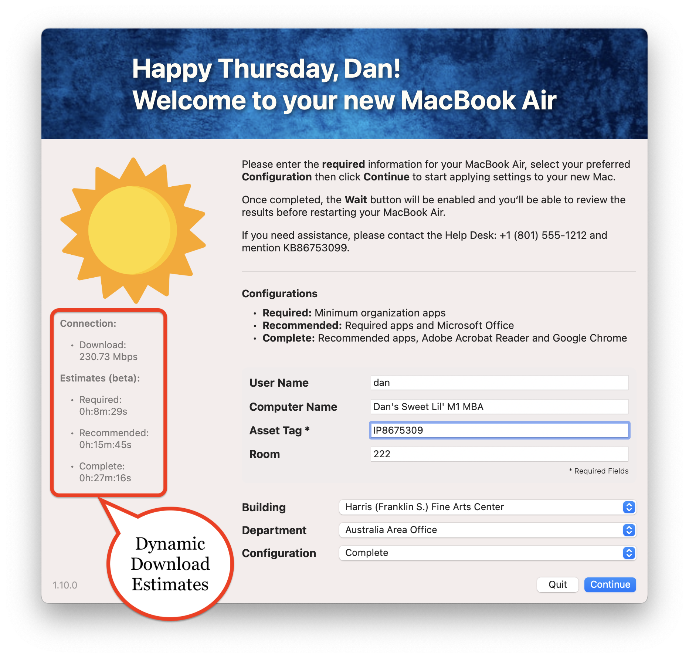

# Setup Your Mac via swiftDialog

    

> New in Setup Your Mac (1.10.0), **Dynamic Download Estimates** leverage the built-in macOS `networkQuality` binary to provide end-users with approximate Configuration durations, based on the _actual speed_ of _their_ specific Internet connection, which can aid end-users in selecting their preferred Configuration.
> 
> Additionally, Mac Admins will appreciate the newly added **Slack** and **Microsoft Teams** integration, **Streamlined Customization** and more, making SYM (1.10.0) one of the most significant upgrades yet.
> 
> > Setup Your Mac (1.11.0) includes bug fixes and leverages several new features of `swiftDialog` `2.2`.

## Introduction

Apple's Automated Device Enrollment helps streamline Mobile Device Management (MDM) enrollment and device Supervision during activation, enabling IT to manage enterprise devices with "zero touch."

**Setup Your Mac** aims to simplify initial device configuration by leveraging `swiftDialog` and Jamf Pro Policy Custom Events to allow end-users to self-complete Mac setup **post-enrollment**.

[Continue reading …](https://snelson.us/sym)

### Script
- [Setup-Your-Mac-via-Dialog.bash](Setup-Your-Mac-via-Dialog.bash)

---

# &ldquo;Setup Your Mac, please&rdquo;

> When auto-launching Self Service post-enrollment isn't enough, **continually** prompt your users to _actually_ setup their Macs

While we _thought_ we'd done everything to help ensure our users had a seamless experience in setting up their new Macs, we recently realized we should **prompt** those users with computers which have successfully enrolled, but still have yet to run our **Setup Your Mac** policy.

[Continue reading …](https://snelson.us/2022/07/setup-your-mac-please/)

### Script
- [Prompt-to-Setup-Your-Mac.bash](Prompt-to-Setup-Your-Mac.bash)
