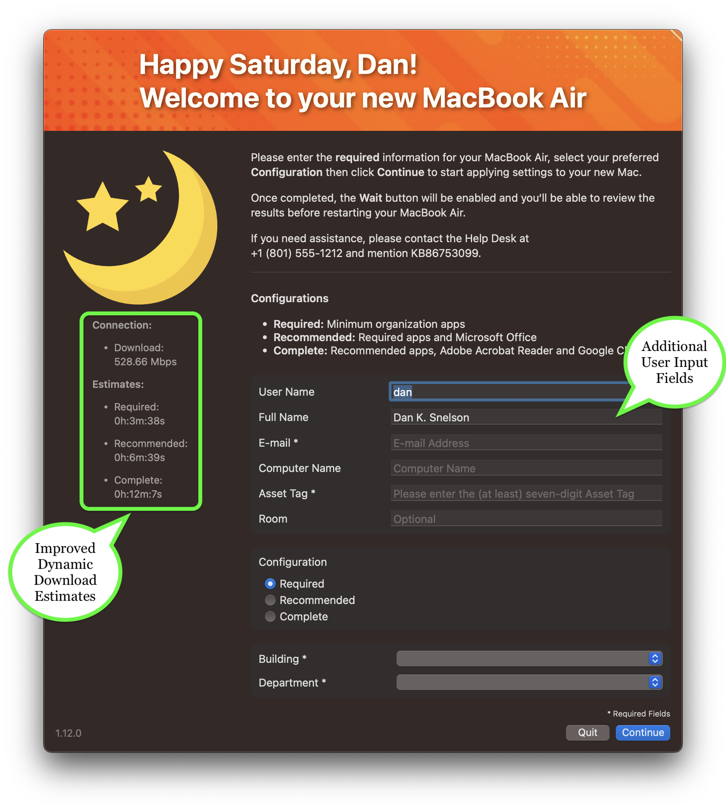

<!-- ALL-CONTRIBUTORS-BADGE:START - Do not remove or modify this section -->

<!-- ALL-CONTRIBUTORS-BADGE:END -->
# Setup Your Mac (1.12.10) via swiftDialog (2.3.2)

    

> With more accurate Dynamic Download Estimates, additional user-input fields and multiple speed improvements, Setup Your Mac (1.12.10) helps MacAdmins provide their users a seamless onboarding experience via swiftDialog (2.3.2).

## Introduction

Apple's Automated Device Enrollment helps streamline Mobile Device Management (MDM) enrollment and device Supervision during activation, enabling IT to manage enterprise devices with "zero touch."

**Setup Your Mac** aims to simplify initial device configuration by leveraging `swiftDialog` and Jamf Pro Policy Custom Events to allow end-users to self-complete Mac setup _post-enrollment_.

[Continue reading …](https://snelson.us/sym)

### Script
- [Setup-Your-Mac-via-Dialog.bash](Setup-Your-Mac-via-Dialog.bash)

---

# &ldquo;Setup Your Mac, please&rdquo;

> When auto-launching Self Service post-enrollment isn't enough, **continually** prompt your users to _actually_ setup their Macs

While we _thought_ we'd done everything to help ensure our users had a seamless experience in setting up their new Macs, we recently realized we should **prompt** those users with computers which have successfully enrolled, but still have yet to run our **Setup Your Mac** policy.

[Continue reading …](https://snelson.us/2022/07/setup-your-mac-please/)

### Script
- [Prompt-to-Setup-Your-Mac.bash](Prompt-to-Setup-Your-Mac.bash)

## Contributors ✨

Thanks goes to these wonderful people ([emoji key](https://allcontributors.org/docs/en/emoji-key)):

<!-- ALL-CONTRIBUTORS-LIST:START - Do not remove or modify this section -->
<!-- prettier-ignore-start -->
<!-- markdownlint-disable -->
<table>
  <tbody>
    <tr>
      <td align="center" valign="top" width="14.28%"><a href="https://github.com/bartreardon"> <b>Bart Reardon</b></a> <a href="https://github.com/dan-snelson/Setup-Your-Mac/commits?author=bartreardon" title="Code">💻</a></td>
    </tr>
  </tbody>
</table>

<!-- markdownlint-restore -->
<!-- prettier-ignore-end -->

<!-- ALL-CONTRIBUTORS-LIST:END -->

This project follows the [all-contributors](https://github.com/all-contributors/all-contributors) specification. Contributions of any kind welcome!