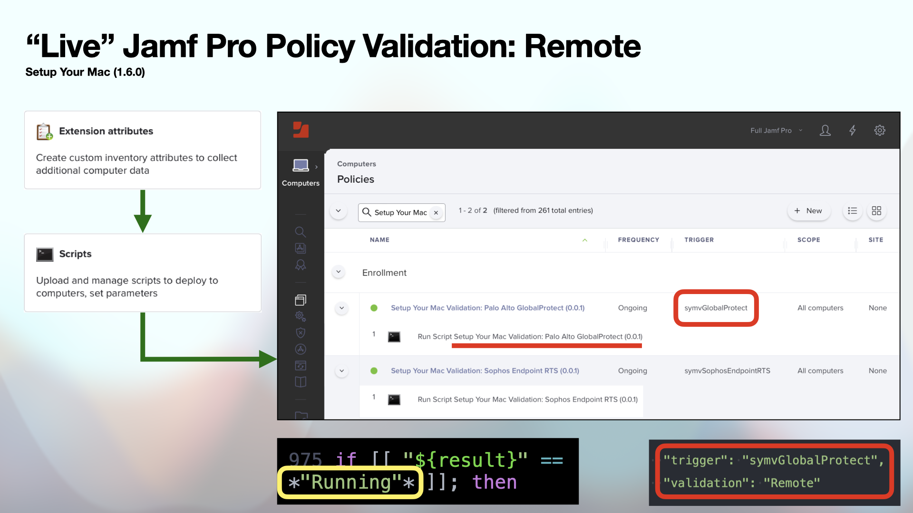

# Setup Your Mac: Jamf Pro Policy Validation

> Learn how to implement remote Jamf Pro policy validation with Setup Your Mac (1.6.0 or later)

## Background

The implementation of recent [feature request](https://github.com/dan-snelson/dialog-scripts/issues/21) to **Setup Your Mac** (1.6.0) introduces additional policy validation options to help ensure critical enterprise applications are both _installed_ and their related services are **running**.

[Continue reading …](https://snelson.us/2023/01/setup-your-mac-validation/)

### Scripts
- [Check Printer Install](Check%20Printer%20Install.sh)
- [CrowdStrike Falcon Status](CrowdStrike%20Falcon%20Status.bash)
- [Microsoft Office 365](Microsoft%20Office%20365.bash)
- [Palo Alto Networks GlobalProtect Status](Palo%20Alto%20Networks%20GlobalProtect%20Status.bash)
- [Sophos Endpoint RTS](Sophos%20Endpoint%20RTS.bash)